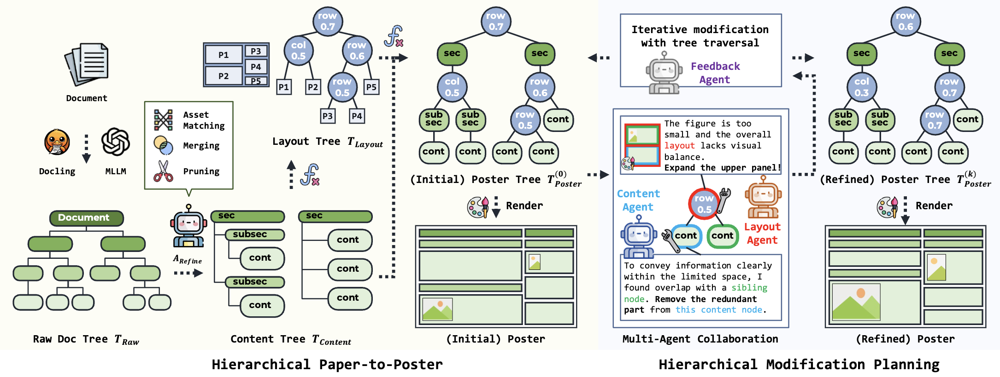
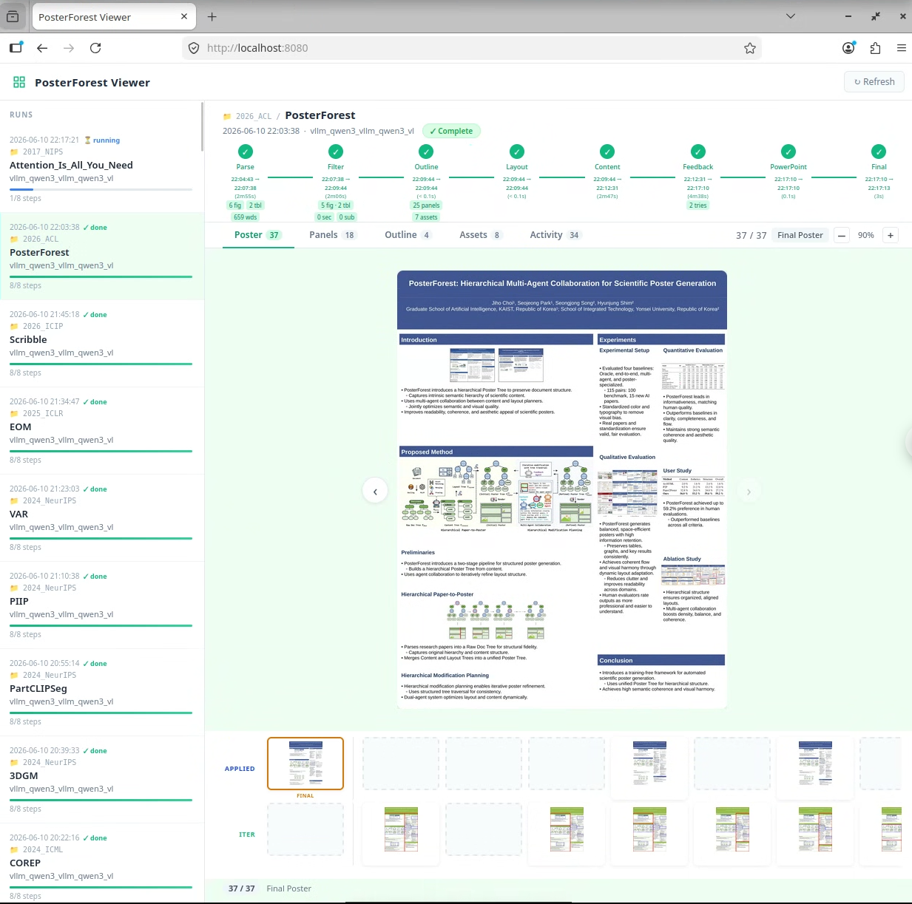
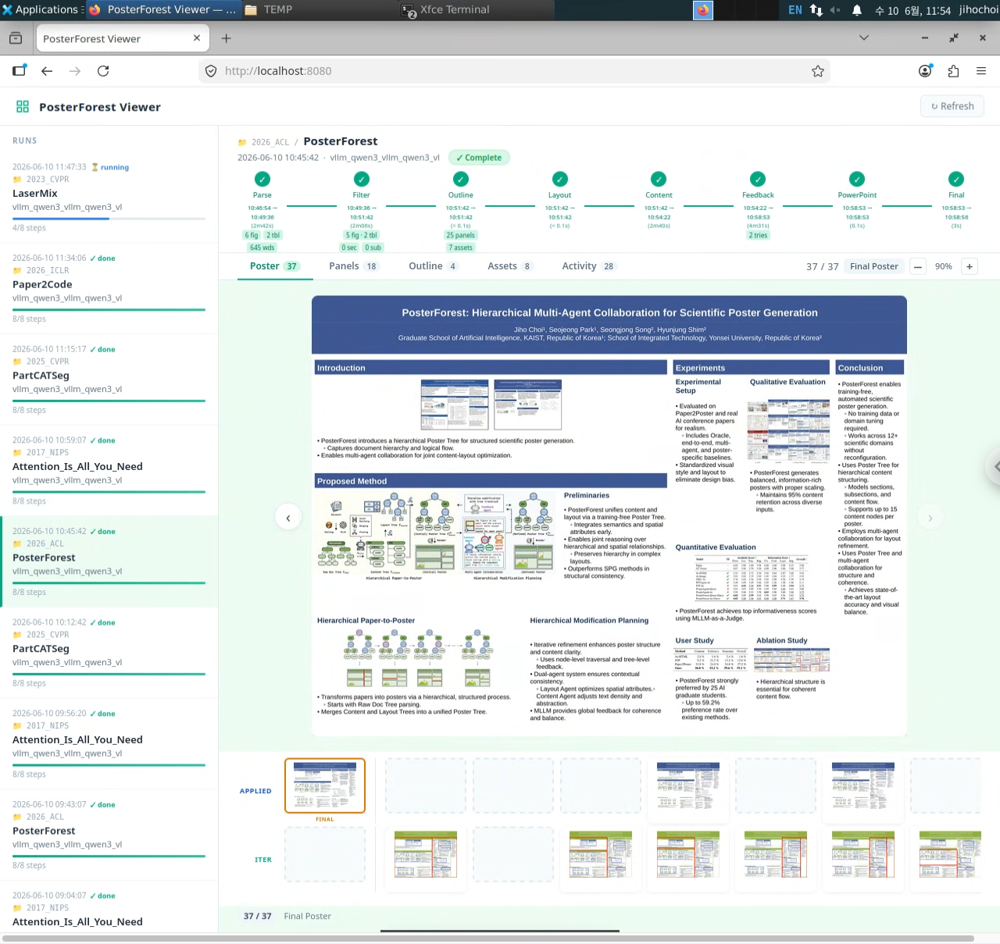

# 🌲🌳 PosterForest: Hierarchical Multi-Agent Collaboration for Scientific Poster Generation

<p align="center">
  <a href="https://arxiv.org/abs/2508.21720"></a>
  
  
</p>

<p align="center">
  <a href="https://jihochoi.github.io/">Jiho Choi</a><sup>1 *</sup>,&nbsp;
  <a href="https://sjpark5800.github.io/">Seojeong Park</a><sup>1 *</sup>,&nbsp;
  Seongjong Song<sup>2</sup>,&nbsp;
  <a href="https://kaist-cvml.github.io/index.html">Hyunjung Shim</a><sup>1 †</sup>
</p>
<p align="center">
  <sup>1</sup> Graduate School of Artificial Intelligence, KAIST, Republic of Korea<br>
  <sup>2</sup> School of Integrated Technology, Yonsei University, Republic of Korea<br>
  <sup>*</sup> Equal contribution &nbsp;&nbsp; <sup>†</sup> Corresponding author<br>
  <!-- {jihochoi, seojeong.park, kateshim}@kaist.ac.kr &nbsp;|&nbsp; bell@yonsei.ac.kr -->
</p>

---

PosterForest is a training-free, hierarchical multi-agent system that automatically generates editable scientific posters (`poster.pptx`) from a paper PDF. It introduces a **Poster Tree** intermediate representation that captures document hierarchy and visual-textual semantics, enabling agents to conduct hierarchical reasoning and recursive refinement from global organization down to local composition.

<p align="center">
  
</p>

---

## Preview

<table>
  <tr>
    <th align="center">Portrait (36 × 48 in)</th>
    <th align="center">Landscape (48 × 36 in)</th>
  </tr>
  <!-- <tr>
    <td align="center"></td>
    <td align="center"></td>
  </tr> -->
  <tr>
    <td align="center"></td>
    <td align="center"></td>
  </tr>
</table>

---

## Installation

```bash
conda create -n poster-forest python=3.10 -y
conda activate poster-forest
pip install -r requirements.txt
pip install "docling-parse==4.5.0"

# System Dependencies
sudo apt-get install ttf-mscorefonts-installer msttcorefonts  # fonts
sudo apt install libreoffice  # PPTX → image rendering
conda install -c conda-forge poppler  # PDF utilities

# API key (if using GPT-4o)
echo "OPENAI_API_KEY=<your_key>" > .env
```

---

## Quick Start

Place your paper PDF under `papers/{paper_dir}/`:

```
papers/
├── 2017_NIPS/
│   └── Attention_Is_All_You_Need.pdf
└── 2026_ACL/
    └── PosterForest.pdf
```

**Using GPT-4o:**

```bash
python -m PosterForest.main \
    --paper_path="papers/2017_NIPS/Attention_Is_All_You_Need.pdf" \
    --model_name_t="4o" \
    --model_name_v="4o" \
    --poster_width_inches=48 \
    --poster_height_inches=36
```

<sub>(API costs approximately $0.8 per poster with GPT-4o.)</sub>

**Using Qwen3** (local - start vLLM servers first, see below):

```bash
python -m PosterForest.main \
    --paper_path="papers/2017_NIPS/Attention_Is_All_You_Need.pdf" \
    --model_name_t="vllm_qwen3" \
    --model_name_v="vllm_qwen3_vl" \
    --poster_width_inches=48 \
    --poster_height_inches=36
```

Output is saved to `outputs/{timestamp}_{model_t}_{model_v}_{paper_name}/08_finalize_output/`:

```
08_finalize_output/
├── poster_final.pptx   ← editable poster
└── poster_final.jpg    ← rendered preview
```

**Viewer** - browse all generated posters in a local web UI:

```bash
uvicorn utils.viewer.server:app --reload --port 8080
# open http://localhost:8080
```

---

## vLLM Setup (Local MLLMs)

Requires [vLLM](https://docs.vllm.ai/) ≥ 0.12.0 (for Qwen3-VL support).

**Qwen3** (LLM on GPU 0-3, VLM on GPU 4-7):

```bash
conda activate poster-forest
bash scripts/start_vllm_qwen3.sh
```

**Qwen2.5** (LLM on GPU 4,5, VLM on GPU 6,7):

```bash
conda activate poster-forest
bash scripts/start_vllm_qwen2_5.sh
```

Wait until both servers are ready:

```bash
curl http://localhost:8005/health
curl http://localhost:8010/health
```

Model strings and endpoints are defined in [`utils/wei_utils.py`](utils/wei_utils.py).

---

## Evaluation

For evaluation setup and metrics (PaperQuiz, VLM-as-Judge, etc.), please refer to the [Paper2Poster (NeurIPS 2025 D&B)](https://github.com/Paper2Poster/Paper2Poster) repository.

---

## Acknowledgements

We thank [CAMEL (NeurIPS 2023)](https://github.com/camel-ai/camel), [OWL (NeurIPS 2025)](https://github.com/camel-ai/owl), [Docling](https://github.com/docling-project/docling), [PPTAgent (EMNLP 2025)](https://github.com/icip-cas/PPTAgent), [Paper2Poster (NeurIPS 2025 D&B)](https://github.com/Paper2Poster/Paper2Poster), and [P2P (ICLR 2026)](https://github.com/multimodal-art-projection/P2P) for their open-source codebases.

---

## Citation

```bibtex
@inproceedings{posterforest2026,
  title     = {PosterForest: Hierarchical Multi-Agent Collaboration for Scientific Poster Generation},
  author    = {Jiho Choi and Seojeong Park and Seongjong Song and Hyunjung Shim},
  booktitle = {Proceedings of the 64th Annual Meeting of the Association for Computational Linguistics (ACL)},
  year      = {2026},
}
```
