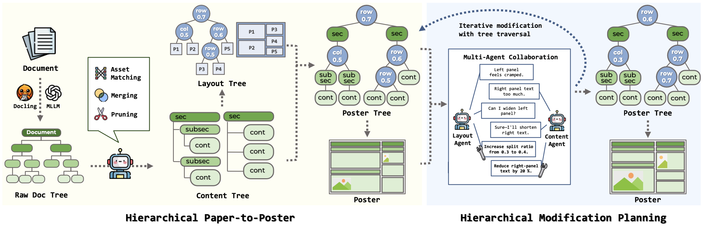

<h2 align="center">
    PosterForest:<br>
    Hierarchical Multi-Agent Collaboration for Scientific Poster Generation
</h2>

<h5 align="center">
    Jiho Choi<sup>*</sup>, Seojeong Park<sup>*</sup>, Seongjong Song, Hyunjung Shim<sup>†</sup><br/>
    <br/>
    <p>
        * equal contribution  † corresponding author
    </p>
    Graduate School of Artificial Intelligence, KAIST, Republic of Korea<br/>
    School of Integrated Technology, Yonsei University, Republic of Korea<br/>
    <br/>
    <code>{jihochoi, seojeong.park, kateshim}@kaist.ac.kr</code>,
    <code>{bell}@yonsei.ac.kr</code>
</h5>

<h4 align="center">
    <a href="#">  </a>
</h4>

<div align="center">
    
</div>

<br/>

## Overview

**PosterForest** is a training-free framework for automated scientific poster generation that takes research papers as input. The core idea is to create a **Poster Tree** that jointly represents document hierarchy and text-visual relationships, while content and layout agents engage in **iterative collaboration and feedback** to compress content and adjust layouts. This process simultaneously optimizes logical consistency and visual balance.

<br/>

<!-- ## Key Features

- 🌳 **Poster Tree**: Unified intermediate representation integrating hierarchical structure and visual-textual relationships
- 🤝 **Multi-Agent Collaboration**: Content and layout experts cooperatively establish modification plans through mutual interaction
- 🔄 **Iterative Refinement**: Tree-based iterative updates that simultaneously improve information density and readability

<br/> -->

## Updates

- 💻 **Code Release**: TBA

<br/>

<!-- 
## Installation

### Prerequisites
- Python 3.8 or higher
- CUDA 11.8+ (for GPU acceleration)
- Git

### Setup Environment

```bash
# Create conda environment
conda create -n posterforest python=3.10 -y
conda activate posterforest

# Install PyTorch
pip install torch==2.1.2+cu118 torchvision==0.16.2+cu118 --extra-index-url https://download.pytorch.org/whl/cu118

# Install dependencies
pip install -r requirements.txt
```

<br/>

## Data Preparation

### Scientific Paper Dataset

Prepare your dataset in the following structure:

```
data/
├── papers/
│   ├── paper_1.pdf
│   ├── paper_2.pdf
│   └── ...
├── metadata/
│   ├── paper_1.json
│   ├── paper_2.json
│   └── ...
└── output/
    ├── posters/
    └── intermediate/
```

<br/>

## Usage

### Quick Start

```bash
# Generate a poster from a single paper
python src/main.py --config-name generate_poster --input-paper path/to/paper.pdf

# Batch processing multiple papers
python src/main.py --config-name batch_generate --input-dir data/papers/

# Custom configuration
python src/main.py --config-name custom_config --agent-config config/agents.yaml
```

### Advanced Usage

```python
from src.poster_forest import PosterForest
from src.agents import ContentAgent, LayoutAgent, ReviewAgent

# Initialize the system
poster_forest = PosterForest()

# Generate poster with custom configuration
poster = poster_forest.generate_poster(
    input_paper="path/to/paper.pdf",
    template="academic_standard"
)
```

<br/>

## Evaluation

```bash
# Evaluate poster quality
python evaluate.py --input-dir data/output/posters/ --metrics all

# Specific evaluation metrics
python evaluate.py --input-dir data/output/posters/ --metrics layout,content,visual
```

<br/>

## Citation

If you use PosterForest in your research, please cite our paper:

```bibtex
@article{choi2025posterforest,
  title={PosterForest: Hierarchical Multi-Agent Collaboration for Scientific Poster Generation},
  author={Choi, Jiho and Park, Seojeong and Song, Seongjong and Shim, Hyunjung},
  journal={arXiv preprint arXiv:TBA},
  year={2025}
}
```

<br/>

## Acknowledgements

We would like to express our gratitude to the prior research in automated scientific poster generation and the open-source community for their valuable contributions. -->
