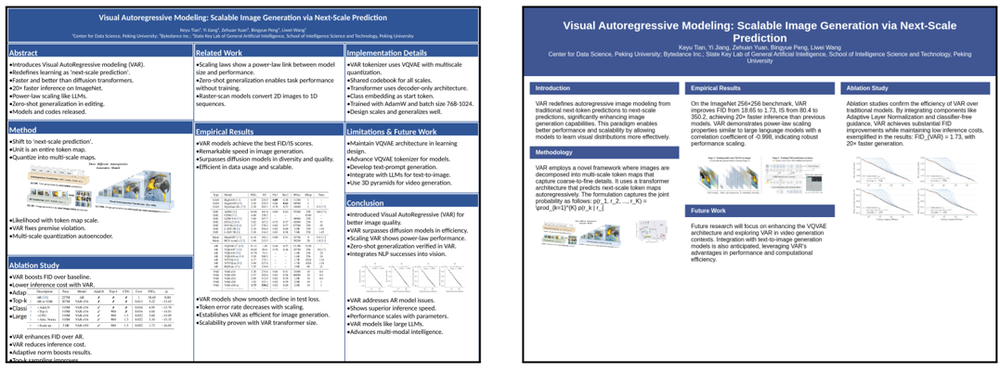
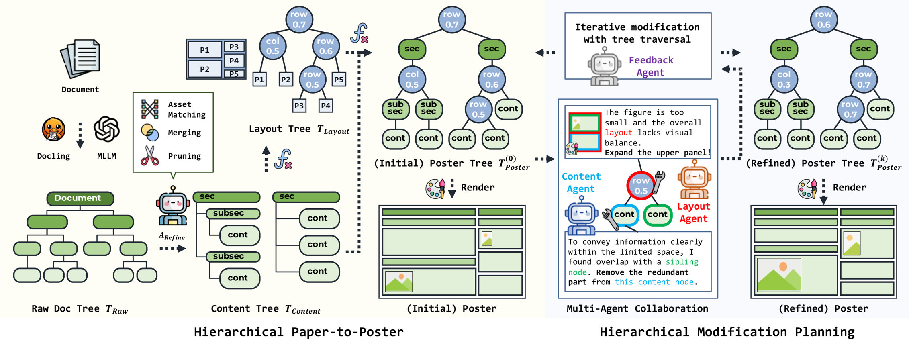
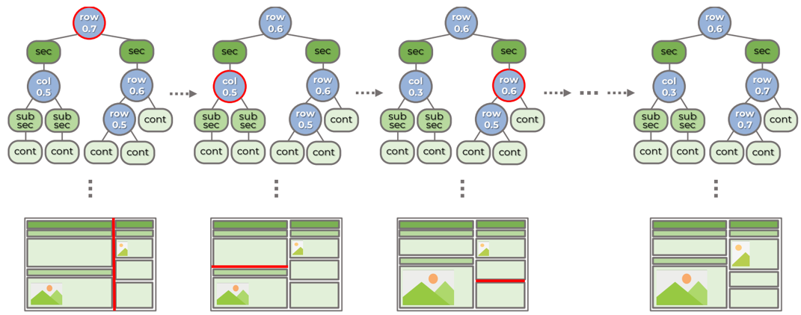
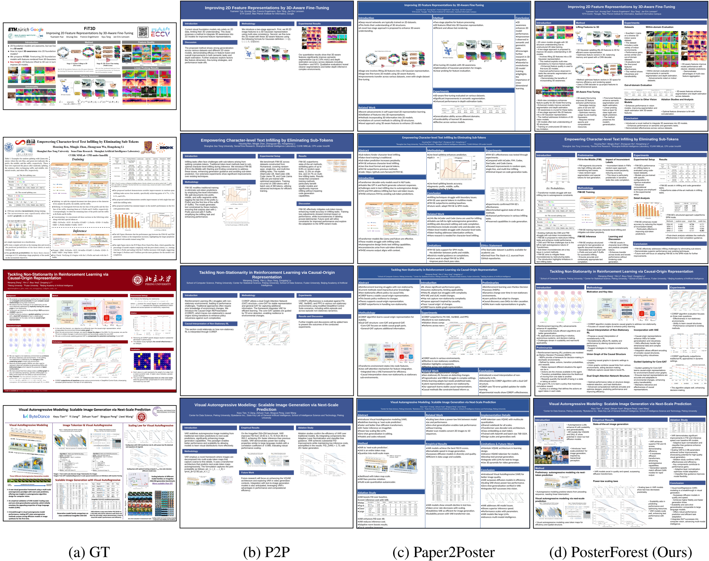
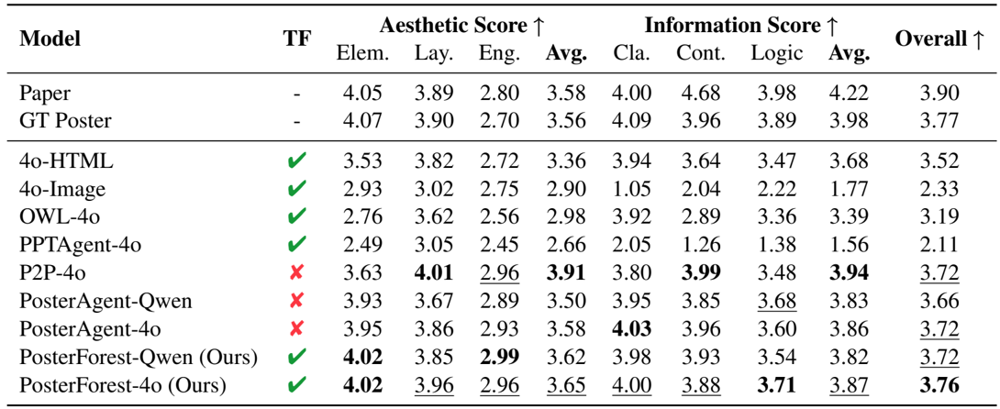
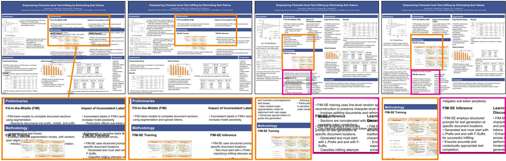
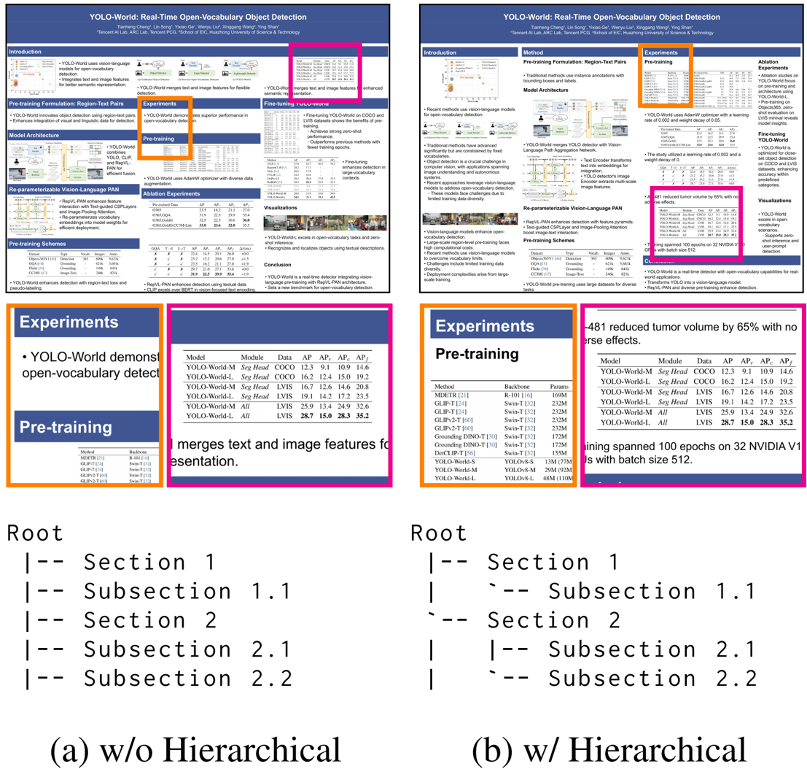

## PosterForest: Hierarchical Multi-Agent Collaboration for Scientific Poster Generation

Jiho Choi 1 * , Seojeong Park 1 * , Seongjong Song 2 , Hyunjung Shim 1 † 1 Graduate School of Artificial Intelligence, KAIST, Republic of Korea 2 School of Integrated Technology, Yonsei University, Republic of Korea

{jihochoi, seojeong.park, kateshim}@kaist.ac.kr, {bell}@yonsei.ac.kr

## Abstract

Automating scientific poster generation requires hierarchical document understanding and coherent content-layout planning. Existing methods often rely on flat summarization or optimize content and layout separately. As a result, they often suffer from information loss, weak logical flow, and poor visual balance. We present PosterForest , a training-free framework for scientific poster generation. Our method introduces the Poster Tree , a structured intermediate representation that captures document hierarchy and visual-textual semantics across multiple levels. Building on this representation, content and layout agents perform hierarchical reasoning and recursive refinement, progressively optimizing the poster from global organization to local composition. This joint optimization improves semantic coherence, logical flow, and visual harmony. Experiments show that PosterForest outperforms prior methods in both automatic and human evaluations, without additional training or domain-specific supervision. Code: https://github.com/ kaist-cvml/poster-forest

## 1 Introduction

With the rapid advancement of science and technology, there has been an exponential increase (Hanson et al., 2024; Larsen and Von Ins, 2010) in the number of academic papers and technical reports with complex structures. As these documents are often difficult to interpret quickly, readers are required to invest significant time and cognitive resources to understand their main arguments. In this context, scientific posters have emerged as an effective medium for summarizing and presenting complex information in a concise and visually intuitive manner. By combining textual and visual elements, posters facilitate more accessible communication of technical content. However, manually crafting

* Equal contribution

† Corresponding author

- (a) Paper2Poster

(b) P2P

Figure 1: Limitations of Current SPG Methods. Existing state-of-the-art scientific poster generation (SPG) methods, including P2P (Sun et al., 2025) and Paper2Poster (Pang et al., 2025), lack hierarchical document understanding, resulting in errors in both content and layout . (a) shows an example where an experiment table is incorrectly placed in the conclusion section. (b) illustrates an overly simplified poster, where paragraphs are merely summarized and assigned to fixed panels with fixed-sized figures.

high-quality posters is a labor-intensive process that requires both domain knowledge and design expertise (Qiang et al., 2019; Wang et al., 2024). Automating scientific poster generation (SPG) is therefore a critical research problem, as it can accelerate the dissemination of specialized knowledge and reduce the burden on researchers.

Pioneering works such as PGM (Qiang et al., 2016, 2019), NCE (Xu and Wan, 2021), and PostDoc (Jaisankar et al., 2024) approached automated poster generation by extracting text and figures from scientific documents and heuristically arranging them within poster panels. However, these approaches rely on fixed rules and struggle to handle the complexity of long, structured documents and the interplay between textual and visual content. To address this, more recent methods, including P2P (Sun et al., 2025) and Paper2Poster (Pang et al., 2025), adopt multi-agent pipelines that decompose the task into specialized sub-problems such as parsing, content summarization, layout planning, and rendering. This modular design improves flexibility and coordination across stages, but typically requires explicit model training, such as instruction tuning or regressor-based optimization.

Despite these advances, current approaches suffer from several critical limitations. (1) Shallow Document Understanding: They primarily depend on surface-level text features, lacking a deep grasp of the hierarchical structure inherent to scientific documents and the semantic associations between textual and visual components. Consequently, they often exhibit an interrupted logical flow and weak integration of visual elements as in Figure 1 (a), ultimately reducing the effectiveness of posters in conveying information quickly and accurately. This limitation significantly increases users' cognitive load. (2) Weak ContentLayout Integration: Existing approaches often adopt a sequential pipeline in which the layout is determined before content placement. This decoupled strategy overlooks the intrinsic interdependence between content and layout, treating them as isolated components rather than pursuing their integrated organization. As a result, critical content may be truncated or misplaced, and the logical flow between textual and visual elements is frequently disrupted. Moreover, as shown in Figure 1 (b), this often results in posters that are overly simplified and fail to capture the complexity of the original document, diminishing their practical value. It diminishes the practical value of automated poster generation systems. (3) Training Overhead: Existing methods requiring instruction tuning or regression training pipelines add complexity and resource demands, limiting practical deployment.

In this study, we aim to address these limitations, which overlook both the hierarchical organization of scientific documents and the semantic alignment between content and layout. Such limitations hinder holistic understanding and often result in reduced clarity, visual incoherence, and discrepancies between visual elements and their explanatory context. To address these limitations, we present PosterForest , a novel framework with two core components. For limitation (1), we introduce the Poster Tree , a hierarchical intermediate representation. It prunes and merges document content across the section-subsection-paragraph hierarchy to preserve salient information while reducing redundancy, and explicitly links text with figures and tables. Each node jointly encodes content and layout attributes. This representation, tailored for scientific poster generation, preserves logical flow and strengthens text-visual associations.

For limitation (2), we propose hierarchical mod- ification planning with multi-agent collaboration. Scientific poster generation requires balancing multiple interdependent objectives, such as content fidelity, layout efficiency, and visual coherence, which are difficult to optimize jointly within a single reasoning process. To address this, we decompose the task into specialized roles and employ multiple agents that focus on complementary aspects, including content summarization, layout planning, and visual material placement across different levels of the hierarchy. Through iterative coordination and feedback, these agents collaboratively refine the Poster Tree, enabling effective joint optimization of both content and structure. This results in visually balanced and semantically coherent posters with improved integration of textual and visual information. Finally, addressing limitation (3), the proposed pipeline is training-free and relies only on standard APIs and publicly available checkpoints, enabling practical deployment.

Overall, PosterForest delivers high-quality summarization, visual coherence, and consistent information flow, overcoming the limitations of prior methods. Extensive experiments show that our method consistently outperforms prior approaches in both automatic and human evaluations, achieving up to 59.2% preference in human studies (vs. 27.2% for prior work) while remaining trainingfree.

## 2 Related Work

Scientific Poster Generation. Although generic (i.e., movie, commercial) poster generation is a pervasively researched topic (Gupta et al., 2021; Li et al., 2020; Zheng et al., 2023; Inoue et al., 2023; Gao et al., 2025; Hsu and Peng, 2025), scientific poster generation is more challenging and crucial due to its deliverability of extensive information and reasoning. It has been studied as a layoutdriven summarization problem (Qiang et al., 2016, 2019), where key elements such as panel size, position, and hierarchy are learned from examples. Earlier work, such as Xu and Wan (2021), emphasized the importance of content extraction, proposing a pipeline to select representative text and visuals. An instruction-tuning based P2P (Sun et al., 2025) and a regressor fitting-based Paper2Poster (Pang et al., 2025) are recent approaches of introducing LLM-based multi-agent frameworks to handle parsing, planning, and rendering in a modular way, extending the framework to generate slides such as

Figure 2: Overview of PosterForest. PosterForest first constructs a hierarchical Poster Tree that integrates document semantics and layout (Section 3.2), then iteratively refines it through collaboration between agents to optimize structure and visual coherence (Section 3.3).

PPTAgent (Zheng et al., 2025). These methods are supported by new benchmarks (Wang et al., 2024; Saxena et al., 2025) and evaluation protocols utilizing vision-language models (Lee et al., 2024), enabling fine-grained assessment of visual coherence and content fidelity. While these approaches achieve baseline-level automation, they often treat sections independently, simply mapping them to panels. As a result, the semantic flow and hierarchical connections across sections in the original paper are not well preserved in the generated poster.

Hierarchical Document Parsing and Understanding. Scientific poster generation requires a robust understanding of document structure and content, compared to naive rank-based text extraction (Mihalcea and Tarau, 2004). Early approaches to document understanding leveraged hierarchical parsing methods, such as DocParser (Rausch et al., 2021) and PDF-to-Tree (Zhang et al., 2024a), to recover logical section structures from rendered pages. These techniques enable semantic segmentation of long documents, which is crucial for downstream tasks like summarization and visualization. More recent works employ pre-trained multimodal models (Huang et al., 2022; Lin et al., 2023) or graph-based representations (Gemelli et al., 2022) to jointly model textual and visual elements. OWL (Hu et al., 2025) integrates multiple LLMs for reasoning and understanding documents. Such advances form the basis for extracting salient content needed for poster generation.

Multi-Agent Reasoning and Collaboration. Single-agent reasoning techniques such as Chainof-Thought (CoT) (Wei et al., 2022) and its vari- ations (Yao et al., 2023; Besta et al., 2024; Chen et al., 2022; Gao et al., 2023) enabled logical thinking of models, representatively academic (Team et al., 2024; Zhang et al., 2023) and mathematical (Shao et al., 2024) reasoning. Recent researches take a step forward and explore multi-agent collaboration to further enhance problem-solving capabilities. Instead of relying on a single reasoning path, multi-agent systems assign specialized roles to LLM agents and promote iterative feedback, critique, and coordination (Li et al., 2023; Zhang et al., 2024b; Hong et al., 2023; Tran et al., 2025; Li et al., 2024), successfully simulating collaborative software engineers (Qian et al., 2023), or peer-reviewers of scientific papers (Yu et al., 2024) even generating code from papers (Seo et al., 2025). In the poster generation, this paradigm enables specialized agents to perform document analysis, content summarization, and layout composition (Sun et al., 2025; Pang et al., 2025).

## 3 Proposed Method

## 3.1 Preliminaries

Recent advances in scientific poster generation (SPG), including P2P (Sun et al., 2025) and Paper2Poster (Pang et al., 2025), have introduced multi-agent pipelines that automatically synthesize posters from research papers. These methods leverage multimodal large language models (MLLMs), such as GPT-4 (Achiam et al., 2023) and Qwen (Bai et al., 2023), to extract textual and visual content, summarize key information, and organize it into structured panel layouts.

Among them, Paper2Poster adopts a modular approach. It comprises: (a) a parser that constructs an asset library of textual and visual elements, (b) a planner that matches text content with relevant figures and tables, and (c) a painter-commenter loop that iteratively refines contents inside the panel through vision-language feedback. P2P further leverages instruction tuning to enhance coordination among multiple agents, whereas Paper2Poster employs regressor-based learning to optimize content arrangement and visual composition.

Despite their effectiveness, existing approaches typically treat scientific papers as linear text sequences, disregarding structural relationships among textual units and semantic alignment between text and visuals. Consequently, they capture only shallow associations within and across modalities. Structural cues such as section and subsection boundaries, paragraph-level semantics, and cross-references to figures and tables are often underutilized or entirely ignored. These limitations result in logical discontinuities across the content and weakened correspondence among different elements, ultimately diminishing overall clarity and informativeness.

To address these limitations, we introduce PosterForest , a training-free framework for SPG. PosterForest operates in two main stages: (1) constructing a hierarchical Poster Tree that jointly encodes the document's semantic content and the poster's layout structure, and (2) iteratively refining this Poster Tree through multi-agent collaboration between specialized content and layout experts. The following sections provide a detailed description of each stage.

## 3.2 Hierarchical Paper-to-Poster

Given an input paper (or document) D , we first parse it into a Raw Doc Tree , T Raw . We define T Raw = ( V Raw , E Raw ) as a rooted tree that represents the structural hierarchy of the document contents. Each node v ∈ V Raw corresponds to a document element such as title, section, subsection, paragraph, figure, or table, which contains its raw semantic content. Each directed edge ( u → v ) ∈ E Raw denotes a parent-child relation, indicating that v is a subcomponent of u in the hierarchy. Let A Parser be a parsing agent that extracts this structure as:

<!-- formula-not-decoded -->

The resulting tree explicitly captures both hierarchical organization and referential links, ensuring that figures and tables appear as children of the textual nodes that reference them.

We then refine T Raw into a Content Tree , T Content = ( V Content , E Content ) , which preserves the essential information to construct a scientific poster. Guided by the MLLM agent, this process involves pruning less important nodes, merging redundant or closely related content, and summarizing lengthy textual content, ensuring the resulting structure remains concise, coherent, and focused on key information. During this process, the nodeedge relationships are updated to reflect the revised structure. Let A Refine be a content refinement agent that performs these operations as:

<!-- formula-not-decoded -->

In T Content , each node corresponds to a concise textual unit or a visual asset (e.g., figures and tables), with minor details removed. Each node c ∈ V Content is represented as c = ( t, s ) with t ∈ T semantic denoting the semantic type (e.g., paragraph, figure, table) and s ∈ S semantic denoting the semantic content (summarized text, caption, or visual data). This produces a compact and informative representation tailored for poster generation.

Based on the Content Tree, we establish a Layout Tree , T Layout = ( V Layout , E Layout ) , which specifies the poster's spatial organization. The Layout Tree follows a widely adopted approach (Qiang et al., 2016, 2019; Pang et al., 2025) in poster layout modeling, where the canvas is hierarchically partitioned into regions organized by rows and columns. Unlike previous methods that derive such structures directly from the document layout, our Layout Tree is initialized from T Content , inheriting the hierarchical relationships among content elements, and aligning the layout with the intended content structure of the poster as:

<!-- formula-not-decoded -->

Each layout node l ∈ V Layout is represented as l = ( r, x ) with r ∈ R spatial (region type: row split, column split, panel) and x ∈ X spatial (spatial attributes: normalized position, width, height, aspect ratio). The initial allocation of regions is deterministically derived from content statistics.

Finally, we integrate content and layout into a unified representation, the Poster Tree , T Poster . We define T Poster = ( V Poster , E Poster ) by merging

Figure 3: Poster Tree Traversal (Node-level). The Poster Tree and layout are iteratively updated through the shared decision of the layout and Content Agent.

the Content Tree, T Content , and the Layout Tree, T Layout , where each semantic node is mapped to a spatial region of the poster as:

<!-- formula-not-decoded -->

Each poster node w ∈ V Poster is a heterogeneous node that jointly encodes semantic attributes (e.g., a summarized paragraph or key visual element from T Content ) and spatial attributes placement from T Layout . The merge operation aligns the hierarchical structure of the content with the corresponding layout partition, producing nodes that specify both what information is displayed and where and how it appears on the canvas. This unified tree representation provides an inductive bias tailored for poster generation, as it tightly couples the logical document hierarchy with the visual layout structure.

## 3.3 Hierarchical Modification Planning

After constructing the initial Poster Tree, T (0) poster , we introduce a hierarchical refinement phase that is designed to jointly optimize both content quality and layout organization. In contrast to prior methods (Sun et al., 2025; Pang et al., 2025) that fix the layout and subsequently adjust only the content, our approach traverses the heterogeneous nodes in Poster Tree and performs node-specific updates by leveraging both local attributes and hierarchical context, while further incorporating global evaluation to achieve a more coherent and polished final result.

## 3.3.1 Poster Tree Traversal (Node-level)

Given the initialized Poster Tree, T (0) Poster , refinement begins through a hierarchical traversal from the root toward the leaves. Each node is updated by jointly considering its intrinsic attributes, the propagated information from its parent, and the structural context defined by its descendants. This top-down propagation ensures that modifications applied at higher levels are consistently reflected throughout the tree.

Layout Agent. For each layout node l i ∈ V Poster , the Layout Agent, A LAYOUT optimizes geometric attributes such as region ratios, alignment, and spatial distribution. The optimization is performed by aggregating the structural and semantic statistics of all descendant nodes as:

<!-- formula-not-decoded -->

where ˜ P ( l i ) represents the updated information of the parent node after its refinement, and D ( l i ) denotes the set of all descendants of l i .

Content Agent. For each content node c i ∈ V Poster , A CONTENT refines textual density and semantic abstraction by referencing both the updated configuration of its parent layout node and the descendant layout context of that parent:

<!-- formula-not-decoded -->

where ˜ P ( c i ) represents the updated information of the parent node after its refinement, and D ( P ( c i )) denotes the set of all descendants of the parent node of c i . This hierarchical dependency allows local content updates to reflect global layout constraints and parent-level refinements.

The traversal proceeds until every node has been updated once, yielding an intermediate tree T ( t +1) Poster that captures coherent modifications across both spatial and semantic dimensions. The resulting representation serves as the basis for subsequent global evaluation.

## 3.3.2 Iterative Tree Refinement (Tree-level)

After completing full node-level traversal, PosterForest performs iterative refinement at the tree level to progressively enhance the overall poster structure. Each tree-level iteration corresponds to a complete pass of node-level updates, resulting in a refined Poster Tree that jointly enhances semantic clarity and spatial organization. This process may be repeated up to a maximum of K iterations to incrementally enhance layout quality and content coherence. In practice, we set K = 2 , which empirically yields stable and visually balanced results with a single additional refinement step.

Global Feedback Agent. At each iteration t , the rendering of the current Poster Tree T ( t ) Poster is evaluated by a multimodal large language model

(MLLM) acting as a Global Feedback Agent, denoted as A FEEDBACK . This agent analyzes the poster's visual organization, textual structure, and hierarchical balance, and provides structured global feedback to determine whether an additional treelevel traversal should be executed:

<!-- formula-not-decoded -->

where ˆ F ( t ) GLOBAL denotes the structured global feedback extracted from the MLLM, and π ( t ) CONTINUE ∈ { 0 , 1 } is a binary signal indicating whether another refinement iteration should be performed.

If π ( t ) CONTINUE = 1 , the next tree-level traversal is triggered using the propagated feedback:

<!-- formula-not-decoded -->

where O TRAVERSE denotes one complete pass of the propagation-based node-level refinement defined in Equation (5) and Equation (6). Otherwise, the iterative refinement loop terminates, and the final Poster Tree is obtained as T ∗ Poster = T ( t ) Poster .

## 4 Experiments

## 4.1 Experimental Setup

Baselines. Following the evaluation protocols of P2P (Sun et al., 2025) and Paper2Poster (Pang et al., 2025), we compare four categories of baseline methods. First, Oracle methods represent upper bounds. The original Paper represents the upper bound for content fidelity, while the authorcreated GT Poster indicates the optimal layout and clarity achievable by human experts. Second, end-to-end methods employ GPT-4o to generate posters directly. Specifically, GPT-4o-HTML renders posters by converting the paper into HTML, whereas GPT-4o-Image produces poster images in a single step using GPT-4o. Third, multi-agent workflows encompass general-purpose converters and algorithmic generators. For this category, we evaluate the PDF-to-HTML conversion toolkit of OWL (Hu et al., 2025) and Python-pptx conversion results of PPTAgent . Finally, poster-specialized agents include P2P (Sun et al., 2025), Paper2Poster, and our proposed method. To ensure that visual factors did not influence qualitative evaluations and user studies, we standardized the color scheme and font across all posters.

Datasets. For quantitative evaluation, we used the 100 paper-poster pairs provided by the Paper2Poster benchmark (Pang et al., 2025), which is an extension of the PosterSum dataset (Saxena et al., 2025). For qualitative results and user studies, we additionally collected 15 recent paper-poster pairs from the AI conferences (e.g., NeurIPS, CVPR, and ACL). More comprehensive experimental details are provided in the Appendix. Implementation Details. For further details regarding model architecture and evaluation protocols, please refer to the Appendix.

## 4.2 Qualitative Evaluation

In Figure 4, we compare our method with state-ofthe-art baselines, P2P and Paper2Poster, and the poster made by the authors (Ground Truth). All experiments were conducted using the GPT-4o framework to ensure consistency in model performance. Our approach dynamically adjusts column widths and panel sizes, resulting in a balanced distribution of content. Compared to P2P and Paper2Poster, our method makes more efficient use of space, prevents the inclusion of oversized or undersized figures, and avoids excessively long or verbose paragraphs through strategic hierarchical organization. Notably, our method excels at preserving information: for the VAR paper (4th row), both P2P and Paper2Poster omit either the result table or graph, whereas our method retains both, ensuring that critical information is maintained. Furthermore, our approach demonstrates robust performance across diverse paper formats and academic domains, as illustrated by the examples from 3D Vision-ECCV (1st row), Language Processing-ACL (2nd row), and Reinforcement Learning-ICML (3rd row).

## 4.3 Quantitative Evaluation

Following the evaluation protocol introduced in P2P and Paper2Poster, we employ MLLM-as-aJudge metrics for quantitative evaluation. The GPT4o model is prompted to act as six independent judges, each assigning a score from 1 to 5 based on the following criteria: element quality, layout balance, engagement, clarity, content completeness, and logical flow. The first three criteria assess aesthetics, while the latter three evaluate the informativeness of the generated poster. As shown in Table 1, the judges indicate that our method is comparable to other baselines in terms of aesthetics, and demonstrates superior performance in informativeness. Importantly, these scores are the closest to those of the author-created ground truth posters (GT), demonstrating the effectiveness of our approach. Details of the MLLM-as-a-Judge are

Figure 4: Qualitative Comparison. Posters generated by the SoTA baseline methods and PosterForest , based on papers from various AI fields (NLP, CV, RL), along with the original posters (GT) designed by the authors.

provided in the supplementary material.

While MLLM-based evaluation provides a scalable and objective means for poster assessment, it still has inherent limitations in fully capturing subjective preferences and subtle qualities valued by human readers. Therefore, to complement the quantitative results, we further conduct a user study to obtain human judgments and validate the practical effectiveness of our method.

## 4.4 User Study

To conduct a user study to evaluate poster quality from a human perspective, we recruited 25 participants, all of whom were graduate students in the field of AI and had participated in scientific conferences. The study uses 10 sets (40 questions in total), each consisting of a group of posters and four evaluation questions. Each poster group is generated with four GPT-4o-based methods: 4o-HTML, P2P, Paper2Poster, and our proposed method. For each set, participants are asked to select one poster per

Table 1: MLLM-as-a-Judge score across four categories of baselines. The average score serves as a fine-grained assessment of 6 different perspectives. The best score is bold , and the second is underlined for each criterion. 'TF' denotes Training-free methods.

| Model                    | TF   | Aesthetic Score ↑   | Aesthetic Score ↑   | Aesthetic Score ↑   | Aesthetic Score ↑   | Information Score ↑   | Information Score ↑   | Information Score ↑   | Information Score ↑   | Overall ↑   |
|--------------------------|------|---------------------|---------------------|---------------------|---------------------|-----------------------|-----------------------|-----------------------|-----------------------|-------------|
| Model                    | TF   | Elem.               | Lay.                | Eng.                | Avg.                | Cla.                  | Cont.                 | Logic                 | Avg.                  | Overall ↑   |
| Paper                    | -    | 4.05                | 3.89                | 2.80                | 3.58                | 4.00                  | 4.68                  | 3.98                  | 4.22                  | 3.90        |
| GT Poster                | -    | 4.07                | 3.90                | 2.70                | 3.56                | 4.09                  | 3.96                  | 3.89                  | 3.98                  | 3.77        |
| 4o-HTML                  | ✔    | 3.53                | 3.82                | 2.72                | 3.36                | 3.94                  | 3.64                  | 3.47                  | 3.68                  | 3.52        |
| 4o-Image                 | ✔    | 2.93                | 3.02                | 2.75                | 2.90                | 1.05                  | 2.04                  | 2.22                  | 1.77                  | 2.33        |
| OWL-4o                   | ✔    | 2.76                | 3.62                | 2.56                | 2.98                | 3.92                  | 2.89                  | 3.36                  | 3.39                  | 3.19        |
| PPTAgent-4o              | ✔    | 2.49                | 3.05                | 2.45                | 2.66                | 2.05                  | 1.26                  | 1.38                  | 1.56                  | 2.11        |
| P2P-4o                   | ✘    | 3.63                | 4.01                | 2.96                | 3.91                | 3.80                  | 3.99                  | 3.48                  | 3.94                  | 3.72        |
| PosterAgent-Qwen         | ✘    | 3.93                | 3.67                | 2.89                | 3.50                | 3.95                  | 3.85                  | 3.68                  | 3.83                  | 3.66        |
| PosterAgent-4o           | ✘    | 3.95                | 3.86                | 2.93                | 3.58                | 4.03                  | 3.96                  | 3.60                  | 3.86                  | 3.72        |
| PosterForest-Qwen (Ours) | ✔    | 4.02                | 3.85                | 2.99                | 3.62                | 3.98                  | 3.93                  | 3.54                  | 3.82                  | 3.72        |
| PosterForest-4o (Ours)   | ✔    | 4.02                | 3.96                | 2.96                | 3.65                | 4.00                  | 3.88                  | 3.71                  | 3.87                  | 3.76        |

question based on the following criteria: (1) content fidelity , which poster best reflects the content of the paper; (2) aesthetic quality , which poster is the most visually harmonious; (3) structural clarity , which poster delivers information in the most structurally effective way; and (4) overall quality , which poster appears most complete and well-polished overall. As shown in Table 2, our proposed method

(a) Base

(b) Only Content Agent

(c) Only Layout Agent

(d) Both Agents

Figure 5: Effect of Content and Layout Agents. Using both agents balances layout (orange) and removes redundancy (magenta), yielding well-organized posters with proper information density and strong visual harmony.

| Method       | Content   | Esthetics   | Structure   | Overall   |
|--------------|-----------|-------------|-------------|-----------|
| 4o-HTML      | 2.0%      | 1.6%        | 2.4%        | 1.6%      |
| P2P          | 9.2%      | 21.2%       | 13.2%       | 12.0%     |
| Paper2Poster | 32.8%     | 24.0%       | 24.8%       | 27.2%     |
| Ours         | 56.0%     | 53.2%       | 59.6%       | 59.2%     |

Table 2: Human Evaluation. Numbers represent the proportion of times each method was ranked first for each criterion.

is strongly preferred over the other SoTA baselines across all four criteria. Please refer to the Appendix for further details on the user study.

## 4.5 Ablation Study

## 4.5.1 Effect of Hierarchical Content Tree

We conducted an ablation study to analyze the impact of incorporating hierarchical structure into the Content Tree, T content , during content generation. When the hierarchical organization is omitted, as shown in Figure 6 (a), sections and subsections are often disordered or mixed together on the poster. This results in a loss of semantic grouping and spatial coherence between related elements such as figures and explanatory text. In contrast, applying hierarchical parsing, as in Figure 6 (b), preserves the logical relationships between sections and subsections, ensuring that related content is grouped and displayed in a consistent and interpretable manner. This hierarchical structure enhances both the readability and spatial cohesion of the generated poster, supporting more effective information delivery.

## 4.5.2 Effect of Content and Layout Agents

To evaluate the effectiveness of the multi-agent collaboration, we conducted an ablation study by

Figure 6: Effect of Hierarchical Content Tree. With a hierarchical structure, logical order and spatial coherence are preserved (orange) and text-visual alignment improves; the performance table appears under Experiments rather than Introduction (magenta).

comparing four configurations: (a) the base model with only the initial Poster Tree, (b) Content Agent only, (c) Layout Agent only, and (d) both agents combined. The Content Agent prunes cross-node redundancy and right-sizes the remaining text to the layout, as shown in Figure 5(b), but often leads to suboptimal panel arrangements and unbalanced layouts. In contrast, the Layout Agent focuses on optimizing the spatial arrangement at the layout level. As illustrated in Figure 5 (c), this configuration achieves improved visual organization, but suboptimal figure scaling and text overflow frequently occur due to the lack of content adjustment. When both agents are used together, as shown in Figure 5

(d), the system effectively addresses both content redundancy and layout imbalance, producing wellorganized posters with appropriate information density and visual harmony. These results confirm that the joint use of Content and Layout Agents is essential for achieving both semantic and structural quality in automated poster generation.

## 5 Conclusion

This work proposed PosterForest, a hierarchical multi-agent framework for scientific poster generation that explicitly models the interplay between document structure and layout design. The proposed Poster Tree serves as a unified intermediate representation, enabling integrated reasoning over semantic and spatial attributes. Through hierarchical refinement driven by Content and Layout Agents, our method dynamically balances information density and visual harmony without any training or dataset-specific tuning. Empirical results and user studies confirm that PosterForest substantially outperforms prior methods in informativeness, clarity, and structural quality.

## Limitations

While PosterForest demonstrates significant improvements, certain limitations persist. First, generated posters may not always achieve optimal content density, which can lead to less efficient space utilization. Second, the lack of robust quality metrics may limit the comprehensiveness of quantitative evaluation, highlighting the need for further development of advanced evaluation methodologies in future research. Detailed failure cases and future directions are provided in the supplementary material.

## Ethical Considerations

We rely only on officially released, publicly accessible models and APIs. In all experiments, we call GPT-4o through OpenAI's official interface, and we also use publicly available Qwen checkpoints where noted. We do not fine-tune any models. Our framework is training-free and used strictly within the terms of the providers' licenses. Source papers and posters are analyzed solely for non-commercial research under practices consistent with academic fair use, and we include references to the original sources to respect creator rights. Our human evaluation recruits 25 graduate-level participants with prior conference experience; assessments concern posters only, and no personal attributes are collected or analyzed. An AI assistant was used for sentence-level drafting and refining to improve clarity.

## Acknowledgments

This work was supported by Samsung Research, Samsung Electronics Co., Ltd.; the Basic Science Research Program through the National Research Foundation of Korea (NRF) funded by the Korea government (MSIT) (No. RS-2025-00520207); Institute of Information &amp; Communications Technology Planning &amp; Evaluation (IITP) grants funded by the Korea government (MSIT) (Nos. RS-202400457882, 2022-0-01045, 2022-0-00680); the Advanced GPU Utilization Support Program funded by the Government of the Republic of Korea (Ministry of Science and ICT); and a grant partly supported by both IITP (MSIT) and Korea Evaluation Institute of Industrial Technology (KEIT) (MOTIE) (No. RS-2025-02217259).

## References

Josh Achiam, Steven Adler, Sandhini Agarwal, Lama Ahmad, Ilge Akkaya, Florencia Leoni Aleman, Diogo Almeida, Janko Altenschmidt, Sam Altman, Shyamal Anadkat, and 1 others. 2023. Gpt-4 technical report. arXiv preprint arXiv:2303.08774 .

Jinze Bai, Shuai Bai, Yunfei Chu, Zeyu Cui, Kai Dang, Xiaodong Deng, Yang Fan, Wenbin Ge, Yu Han, Fei Huang, and 1 others. 2023. Qwen technical report. arXiv preprint arXiv:2309.16609 .

Maciej Besta, Nils Blach, Ales Kubicek, Robert Gerstenberger, Michal Podstawski, Lukas Gianinazzi, Joanna Gajda, Tomasz Lehmann, Hubert Niewiadomski, Piotr Nyczyk, and 1 others. 2024. Graph of thoughts: Solving elaborate problems with large language models. In Proceedings of the AAAI conference on artificial intelligence , volume 38, pages 17682-17690.

Wenhu Chen, Xueguang Ma, Xinyi Wang, and William W Cohen. 2022. Program of thoughts prompting: Disentangling computation from reasoning for numerical reasoning tasks. arXiv preprint arXiv:2211.12588 .

Luyu Gao, Aman Madaan, Shuyan Zhou, Uri Alon, Pengfei Liu, Yiming Yang, Jamie Callan, and Graham Neubig. 2023. Pal: Program-aided language models. In International Conference on Machine Learning , pages 10764-10799. PMLR.

Yifan Gao, Zihang Lin, Chuanbin Liu, Min Zhou, Tiezheng Ge, Bo Zheng, and Hongtao Xie. 2025. Postermaker: Towards high-quality product poster